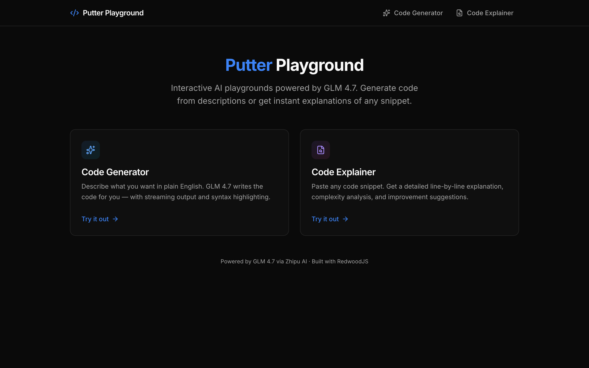
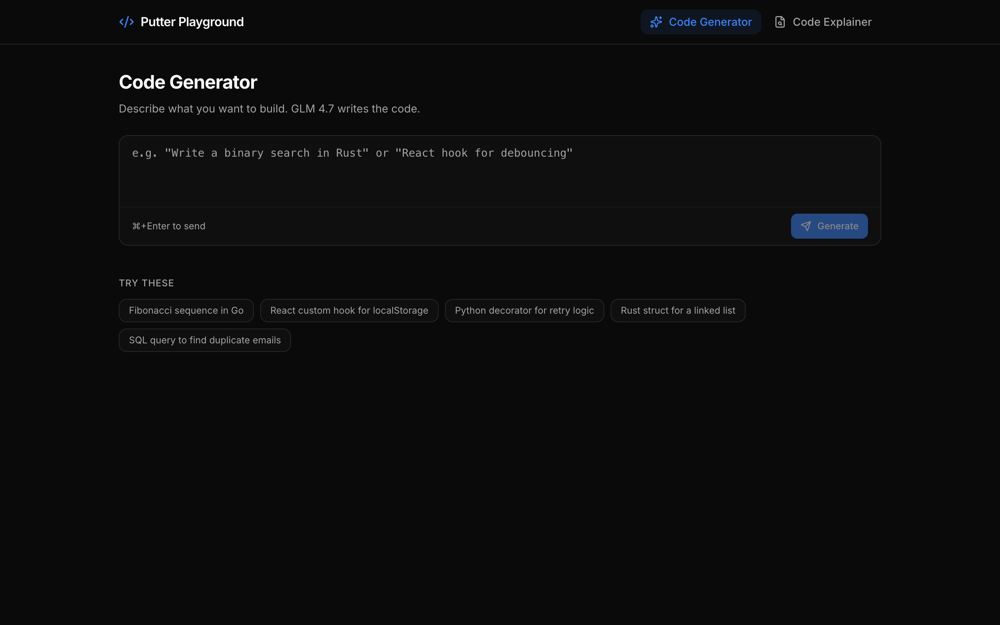
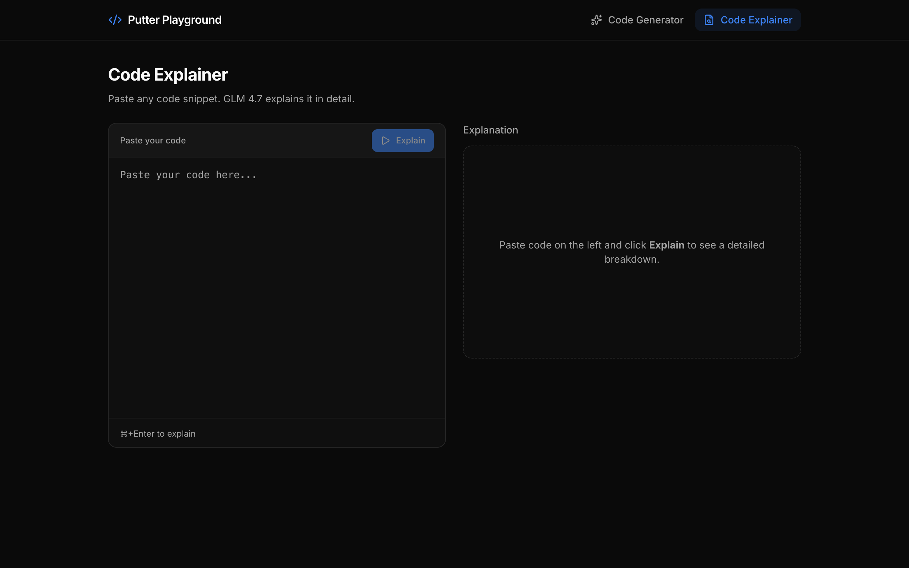

<p align="center">
  
  
  
  
  
</p>

<h1 align="center">Putter Playground</h1>

<p align="center">
  <strong>Interactive AI code playgrounds powered by GLM 4.7</strong>
  <br />
  Generate code from natural language. Explain any snippet in detail.
  <br />
  All with real-time streaming and a beautiful dark UI.
</p>

<p align="center">
  
</p>

---

## About

Putter Playground is a full-stack RedwoodJS app with two AI-powered playgrounds:

- **Code Generator** — Describe what you want in plain English, and GLM 4.7 writes the code for you with real-time streaming output.
- **Code Explainer** — Paste any code snippet and get a detailed line-by-line explanation, complexity analysis, and improvement suggestions.

Built with a dark, minimal aesthetic inspired by [Bits UI](https://bits-ui.com), using [shadcn/ui](https://ui.shadcn.com) components on React.

## Features

**Code Generator**
- Natural language to code in any language
- Real-time streaming with blinking cursor animation
- Language detection and syntax highlighting
- One-click copy to clipboard
- Quick-start example prompts

**Code Explainer**
- Split-pane layout: code input + live explanation
- Markdown-rendered output with headings and code blocks
- Complexity analysis (time & space)
- Actionable improvement suggestions

**Under the hood**
- GraphQL subscriptions over SSE for real-time streaming
- PubSub-based mutation-then-subscribe pattern
- Server-side API key — never exposed to the client
- shadcn/ui + Tailwind CSS dark theme with custom animations

## Screenshots

<table>
  <tr>
    <td align="center"><strong>Code Generator</strong></td>
    <td align="center"><strong>Code Explainer</strong></td>
  </tr>
  <tr>
    <td></td>
    <td></td>
  </tr>
</table>

## Getting Started

### Prerequisites

- [Node.js](https://nodejs.org/) 20.x (use [mise](https://mise.jdx.dev/), nvm, or fnm)
- [Yarn](https://yarnpkg.com/) 4.x (included via corepack)
- A [Zhipu AI](https://www.z.ai) API key for GLM 4.7

### Setup

```bash
# Clone the repo
git clone https://github.com/stussysenik/putter-playground.git
cd putter-playground

# Install dependencies
yarn install

# Configure your API key
cp .env.example .env
# Edit .env and add your Zhipu API credentials:
#   OPENAI_API_KEY=your_key_here
#   OPENAI_API_BASE=https://api.z.ai/api/coding/paas/v4
```

### Run

```bash
yarn rw dev
```

Open [http://localhost:4173](http://localhost:4173) and start playing.

## Architecture

```
┌─────────────────────────────────────────────────────┐
│  Browser (React + shadcn/ui + Tailwind)             │
│                                                     │
│  PromptInput ──► useMutation(generateCode)          │
│                      │                              │
│                      ▼                              │
│  StreamingText ◄── useSubscription(aiStream)        │
└─────────────────────┬───────────────────────────────┘
                      │ GraphQL over SSE
┌─────────────────────▼───────────────────────────────┐
│  API (RedwoodJS + Fastify)                          │
│                                                     │
│  Mutation ──► streamGlmResponse() ──► PubSub        │
│                      │                   │          │
│                      ▼                   ▼          │
│              OpenAI SDK ──► GLM 4.7   Subscription  │
│              (Zhipu API)              resolver       │
└─────────────────────────────────────────────────────┘
```

## Project Structure

```
putter-playground/
├── api/
│   └── src/
│       ├── graphql/aiPlayground.sdl.ts    # GraphQL schema
│       ├── services/aiPlayground/         # GLM streaming logic
│       ├── subscriptions/aiStream/        # Subscription resolver
│       └── lib/glm.ts                     # OpenAI SDK client
├── web/
│   └── src/
│       ├── components/
│       │   ├── AppShell/                  # Layout wrapper
│       │   ├── NavBar/                    # Navigation
│       │   ├── PromptInput/               # Prompt form
│       │   ├── CodeBlock/                 # Syntax highlighting
│       │   ├── CodeTextarea/              # Code input
│       │   ├── StreamingText/             # Live streaming display
│       │   ├── CopyButton/               # Clipboard copy
│       │   ├── LoadingDots/               # Loading animation
│       │   └── ui/                        # shadcn/ui primitives
│       ├── hooks/useAiStream.ts           # Streaming state hook
│       └── pages/
│           ├── HomePage/                  # Landing page
│           ├── CodeGeneratorPage/         # Generate playground
│           └── CodeExplainerPage/         # Explain playground
└── redwood.toml
```

## Tech Stack

| Layer | Technology |
|-------|-----------|
| Framework | [RedwoodJS](https://redwoodjs.com) 8.9 |
| Frontend | React 18, TypeScript |
| Styling | Tailwind CSS 3.4, shadcn/ui |
| API | GraphQL (Yoga), Fastify |
| Realtime | GraphQL Subscriptions over SSE |
| AI | GLM 4.7 via [Zhipu AI](https://www.z.ai) (OpenAI-compatible) |

## License

[MIT](LICENSE)
